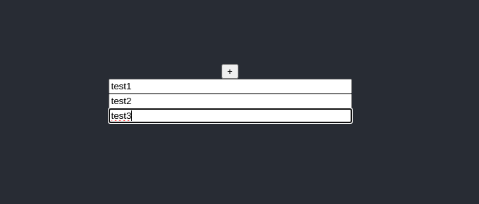

https://stackoverflow.com/questions/66469913/how-to-add-input-field-dynamically-when-user-click-on-button-in-react-js

# setup
```
$ source init-env-nodejs21.sh
$ npx create-react-app component-dynamic-inputs-1 --template typescript
$ cd component-dynamic-inputs-1
$ 
```


