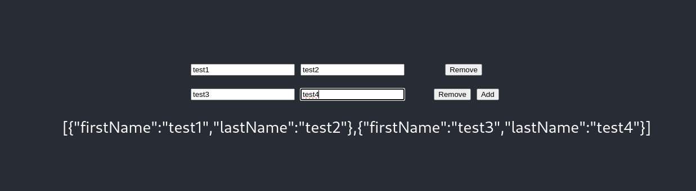

https://www.cluemediator.com/add-or-remove-input-fields-dynamically-with-reactjs

# setup
```
$ source init-env-nodejs21.sh
$ npx create-react-app component-dynamic-inputs --template typescript
$ cd component-dynamic-inputs
$ 
```


